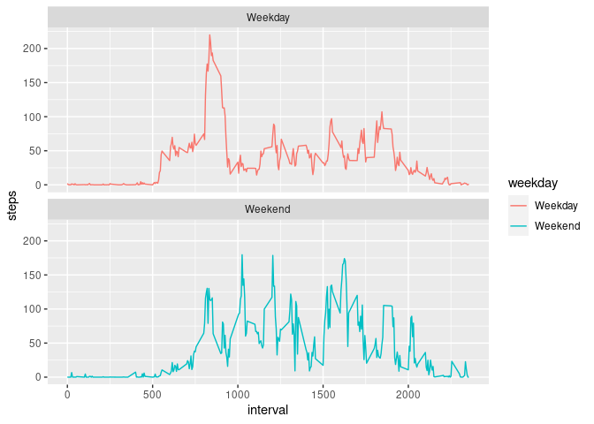

### Loading and preprocessing the data

First, we load the packages `ggplot` and `dplyr` which will we use for
the analysis.

``` r
library(dplyr)
```

    ## 
    ## Attaching package: 'dplyr'

    ## The following objects are masked from 'package:stats':
    ## 
    ##     filter, lag

    ## The following objects are masked from 'package:base':
    ## 
    ##     intersect, setdiff, setequal, union

``` r
library(ggplot2)
```

We load the *activity* dataset in a variable call `act` and we use
the`str` function to see the structure of the dataframe.

``` r
act <- read.csv('activity.csv')
str(act)
```

    ## 'data.frame':    17568 obs. of  3 variables:
    ##  $ steps   : int  NA NA NA NA NA NA NA NA NA NA ...
    ##  $ date    : Factor w/ 61 levels "2012-10-01","2012-10-02",..: 1 1 1 1 1 1 1 1 1 1 ...
    ##  $ interval: int  0 5 10 15 20 25 30 35 40 45 ...

As we can see, the variable `date` was read as a factor by `R`. So we
are going to change it to a date format.

``` r
act$date <- as.Date(act$date, format = '%Y-%m-%d')
str(act)
```

    ## 'data.frame':    17568 obs. of  3 variables:
    ##  $ steps   : int  NA NA NA NA NA NA NA NA NA NA ...
    ##  $ date    : Date, format: "2012-10-01" "2012-10-01" ...
    ##  $ interval: int  0 5 10 15 20 25 30 35 40 45 ...

### What is mean total number of steps taken per day?

Now, we are going to calculate the total number of steps and store it in
a new dataframe call `steps_per_day`.

``` r
steps_per_day <- act %>%
  group_by(date) %>%
  summarise(steps = sum(steps, na.rm = TRUE))
```

    ## `summarise()` ungrouping output (override with `.groups` argument)

``` r
steps_per_day
```

    ## # A tibble: 61 x 2
    ##    date       steps
    ##    <date>     <int>
    ##  1 2012-10-01     0
    ##  2 2012-10-02   126
    ##  3 2012-10-03 11352
    ##  4 2012-10-04 12116
    ##  5 2012-10-05 13294
    ##  6 2012-10-06 15420
    ##  7 2012-10-07 11015
    ##  8 2012-10-08     0
    ##  9 2012-10-09 12811
    ## 10 2012-10-10  9900
    ## # … with 51 more rows

Now, we plot a histogram of the total number of steps taken each day.

``` r
ggplot(steps_per_day, aes(steps)) +
  geom_histogram(binwidth = 2500)
```


As we can see, around 10000 and 12500 steps per day was more frequent.

Now, we calculate the mean and the median for total steps per day.

``` r
steps_per_day %>%
  summarise(mean = mean(steps, na.rm = TRUE), median = median(steps, na.rm = TRUE))
```

    ## # A tibble: 1 x 2
    ##    mean median
    ##   <dbl>  <int>
    ## 1 9354.  10395

### What is the average daily activity pattern?

First, we create a new dataset with average of steps per interval of 5
minutes. Then we plot a time series of the 5-minute interval (x-axis)
and the average number of steps taken.

``` r
avg_per_interval <- act %>%
  group_by(interval) %>%
  summarise(steps = mean(steps, na.rm = TRUE))
```

    ## `summarise()` ungrouping output (override with `.groups` argument)

``` r
ggplot(avg_per_interval, aes(interval, steps)) +
  geom_line()
```


We calculate the maximum steps by an interval which is 835.

``` r
avg_per_interval[avg_per_interval$steps == max(avg_per_interval$steps),]
```

    ## # A tibble: 1 x 2
    ##   interval steps
    ##      <int> <dbl>
    ## 1      835  206.

### Imputing missing values

Calculate the numbers of NA values.

``` r
sum(is.na(act))
```

    ## [1] 2304

Now, we create a new dataframe called `act2` with no missing values and
we get a summary of it.

``` r
act2 <- act

act2$steps <- ifelse(is.na(act2$steps),
         round(avg_per_interval$steps[match(act2$interval,
                                            avg_per_interval$interval)],0), act$steps)

sum(is.na(act2))
```

    ## [1] 0

``` r
summary(act2)
```

    ##      steps             date               interval     
    ##  Min.   :  0.00   Min.   :2012-10-01   Min.   :   0.0  
    ##  1st Qu.:  0.00   1st Qu.:2012-10-16   1st Qu.: 588.8  
    ##  Median :  0.00   Median :2012-10-31   Median :1177.5  
    ##  Mean   : 37.38   Mean   :2012-10-31   Mean   :1177.5  
    ##  3rd Qu.: 27.00   3rd Qu.:2012-11-15   3rd Qu.:1766.2  
    ##  Max.   :806.00   Max.   :2012-11-30   Max.   :2355.0

We create a new data frame called `steps_per_dayComp` which contain the
total steps by date without missing values. Then, we plot a histogram
and we can note that it is a little bit different than the previous
histogram with missing values.

``` r
steps_per_dayComp <- act2 %>%
  group_by(date) %>%
  summarise(steps = sum(steps))
```

    ## `summarise()` ungrouping output (override with `.groups` argument)

``` r
ggplot(steps_per_dayComp, aes(steps)) +
  geom_histogram(binwidth = 2500)
```


We calculate the new mean and median and we can see that there is a
difference with the previous one.

``` r
steps_per_dayComp %>%
  summarise(mean = mean(steps), median = median(steps))
```

    ## # A tibble: 1 x 2
    ##     mean median
    ##    <dbl>  <dbl>
    ## 1 10766.  10762

### Are there differences in activity patterns between weekdays and weekends?

First, we create a new variable call `wd` that take the date and give
the day of the week (i.e lunes, martes, etc). Then, we create a factor
variable with two levels, which are **Wekend** and **Weekday**.

``` r
act2 <- act2 %>%
  mutate(wd = weekdays(date))

act2$weekday <- ifelse(act2$wd=='sabado' | act2$wd=='domingo', 'Weekend','Weekday')
```

Now, we plot the two time series in a single plot and we can note that
the number of steps are more distributed in weekends.

``` r
avg_per_interval2 <- aggregate(steps~interval + weekday, act2, mean, na.rm = TRUE)
ggplot(avg_per_interval2, aes(interval, steps, color = weekday)) +
  geom_line()+
  facet_wrap(~weekday, ncol = 1, nrow = 2)
```


